<div align="center">

# pokemanion

**Your Pokémon companion for Claude Code.**

One lives in a pane beside every session: it rests while Claude waits, and does
something else while Claude works — so you can tell from the corner of your eye
whether anything is happening.

[](https://github.com/khatriadbhut/pokemanion/actions/workflows/ci.yml)
[](LICENSE)
[](https://nodejs.org)
[](package.json)
[](#what-it-needs)

</div>

<table>
<tr>
  <th align="left" width="16%">waiting</th>
  <th align="left" width="22%">working</th>
  <th align="left">&nbsp;</th>
</tr>
<tr>
  <td align="center">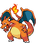</td>
  <td align="center">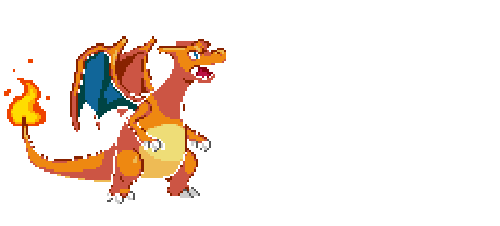</td>
  <td>Charizard breathes fire across the empty half of the pane.</td>
</tr>
<tr>
  <td align="center">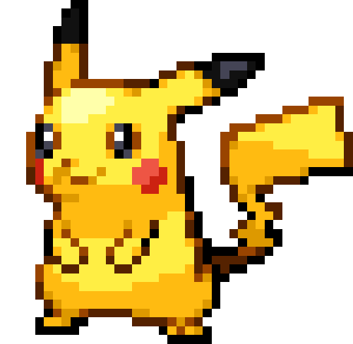</td>
  <td align="center">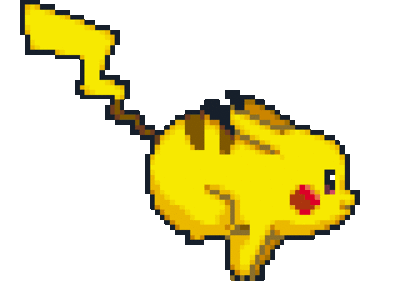</td>
  <td>Pikachu runs. It is the one everything else was tuned against.</td>
</tr>
<tr>
  <td align="center">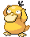</td>
  <td align="center">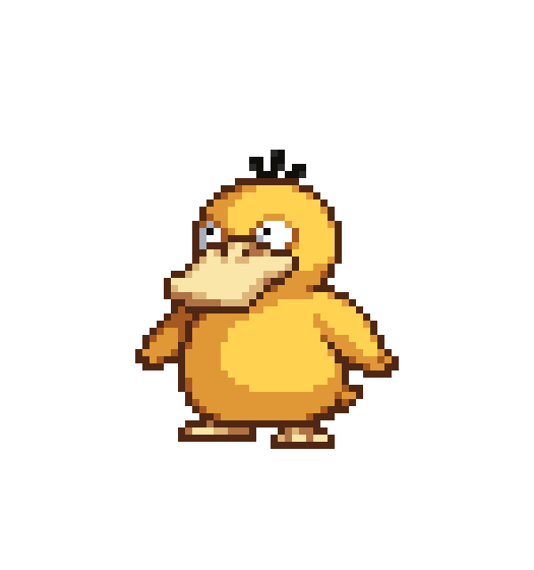</td>
  <td>Psyduck throws its arms about, headache and all.</td>
</tr>
<tr>
  <td align="center">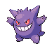</td>
  <td align="center">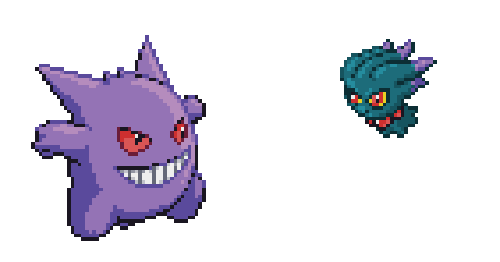</td>
  <td>Gengar fires a shadow beam across the pane.</td>
</tr>
<tr>
  <td align="center">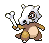</td>
  <td align="center">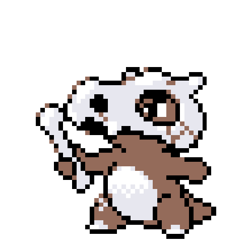</td>
  <td>Cubone swings its bone.</td>
</tr>
</table>

Fourteen hand-tuned residents ship with it. **1252 more** can be summoned by
name and are fetched on the spot.

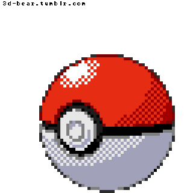

A Pokéball opens whenever one arrives, and its stats appear beside it for a few
seconds. Everything is local: no account, no backend, nothing about you leaving
the machine.

<br clear="left">

**[What it needs](#what-it-needs) · [Install](#install) · [Commands](#commands)
· [Your own sprites](#your-own-sprites) · [Residents and
guests](#residents-and-guests) · [Settings](#settings) ·
[Design notes](docs/design.md)**

<details>
<summary><b>All fourteen residents</b> — resting on the left, working on the right</summary>

<br>

<!-- gallery -->

| | resting | working |
| --- | :---: | :---: |
| **pikachu**<br><sub>own animation</sub> |  |  |
| **ash**<br><sub>own animation</sub> | 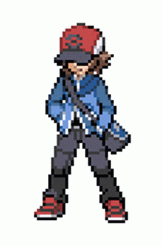 | 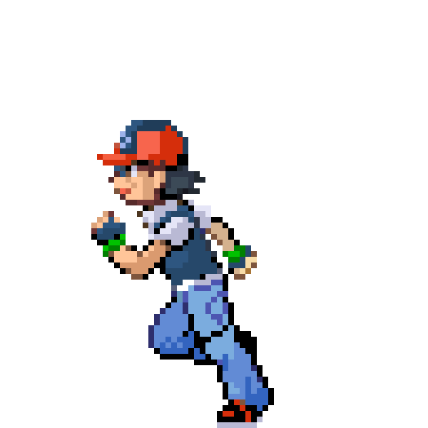 |
| **charmander**<br><sub>its shiny</sub> |  |  |
| **squirtle**<br><sub>its shiny</sub> | 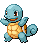 | 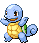 |
| **bulbasaur**<br><sub>its shiny</sub> | 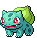 | 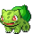 |
| **eevee**<br><sub>its shiny</sub> | 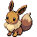 | 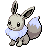 |
| **munchlax**<br><sub>its shiny</sub> | 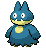 | 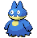 |
| **haunter**<br><sub>its shiny</sub> | 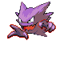 | 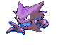 |
| **psyduck**<br><sub>own animation</sub> |  |  |
| **jigglypuff**<br><sub>its shiny</sub> | 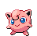 | 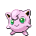 |
| **charizard**<br><sub>own animation</sub> |  |  |
| **meowth**<br><sub>own animation</sub> | 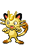 | 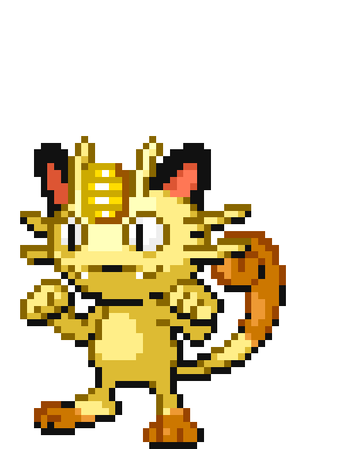 |
| **gengar**<br><sub>own animation</sub> |  |  |
| **cubone**<br><sub>own animation</sub> |  |  |

<!-- /gallery -->

These animate — they are the sprite files themselves, not pictures of them.
Ten work as their own shiny, the same animation recoloured with a white flash
at the switch; four were given animations of their own.

</details>

## What it needs

**Node ≥ 20** (no dependencies), **chafa** (`brew install chafa`, or
`sudo port install chafa`), and a terminal that speaks the [kitty graphics
protocol](https://sw.kovidgoyal.net/kitty/graphics-protocol/) — the sprite is a
real image, not text.

| | draws the sprite | opens the pane for you | `claude --pikachu` |
| --- | :---: | :---: | :---: |
| **macOS + Ghostty** — the only tested setup | yes | yes | yes |
| macOS + kitty, iTerm2, WezTerm, Warp | yes | no | yes |
| Linux + kitty, Konsole | should | no | untested |
| Alacritty, Terminal.app, Windows | no | no | no |

Only the pane-opening is macOS-specific: it splits Ghostty through AppleScript.
Everything else is portable Node. Where it says *no*, run the pane yourself in a
second terminal — `npm run window 4 --session=<id>` — and the rest still works.

**One permission, granted by hand.** Splitting Ghostty means pressing keys, and
macOS blocks that until you allow it — **System Settings → Privacy & Security →
Accessibility → enable Ghostty**. Nothing can script it, and without it no pane
opens.

The `claude --pikachu` wrapper works in **zsh and bash**, and installs into
whichever you use — `~/.zshrc`, or `~/.bash_profile`/`~/.bashrc`. On any other
shell you lose the launch flags only; everything typed *inside* Claude goes
through a hook and works regardless.

## Install

```sh
git clone https://github.com/khatriadbhut/pokemanion.git
cd pokemanion
npm run deps      # chafa and Ghostty — skip if you have them
npm run setup
```

`deps` uses Homebrew or MacPorts, whichever you have. It will not install a
package manager for you — if you have neither, it prints the route for each:
Ghostty ships a [`.dmg`](https://ghostty.org/download), and chafa builds
[from source](https://hpjansson.org/chafa/download/).

`setup` downloads the sprites, renders them, registers the hooks in
`~/.claude/settings.json`, adds the `claude()` wrapper to `~/.zshrc`, and sets
the one Ghostty keybind the pane needs. It checks its prerequisites first and
stops without touching anything if one is missing. Safe to run again.

Then four things it cannot do for you:

1. **Restart Claude Code** — it reads the hooks at startup.
2. **Restart Ghostty** — it reads its config at startup.
3. **Open a new terminal**, or `source ~/.zshrc`.
4. **Allow Ghostty in Accessibility** — [see above](#what-it-needs), once.

A pane should appear beside your next session.

```sh
npm run doctor                # if it doesn't
```

`doctor` is the thing to run whenever something looks wrong. It checks the hooks
are registered, chafa is present, the frame cache matches your pane height, and
which Pokémon are currently held.

**If a sprite stutters or freezes for a second**, that is the frame cache. Frames
are rendered per pane height, so resizing the pane — or switching to a Pokémon
nobody has warmed — leaves it rendering on the fly. `doctor` names it exactly:

```
✘ cache matches the pane   pane is 4 rows but only 20 of 28 sprites are
                           warmed for it — run: npm run warm -- 4
```

Run what it tells you. Warm sprites load in about **3 ms**; cold ones take
**one to two seconds**, which is the stutter. A Pokémon summoned for the first
time always pays that once — roughly two seconds to fetch and render — and is
instant every time after.

<details>
<summary>Doing it a piece at a time</summary>

<br>

Each step `setup` runs is still its own command, for when only one needs
redoing:

```sh
npm run roster                  # fetch the sprites
npm run warm                    # render them for a 4-row pane
npm run install-statusline      # wire the hooks into ~/.claude/settings.json
npm run shell -- --install      # add the claude() wrapper to ~/.zshrc
npm run ghostty -- --install    # the resize keybind, so the pane is a strip
```

The keybind is not optional: collapsing the new split into a strip is one press
of a large resize step, and Ghostty's built-in step is ten pixels. Without it
the pane arrives at half your window height.

</details>

### What it touches outside this folder

Three files. Each is backed up before the first write, and each comes back out:

| file | what goes in | undo |
| --- | --- | --- |
| `~/.claude/settings.json` | seven hooks | `npm run uninstall-statusline` |
| `~/.zshrc` | the `claude()` wrapper | `npm run shell -- --remove` |
| `~/.config/ghostty/config` | one resize keybind | `npm run ghostty -- --remove` |

Nothing else leaves the repo. Undo those three, delete the folder, and no trace
is left.

## Commands

Starting a session:

```sh
claude --pikachu             # a particular one
claude --flygon              # any of the 1252, fetched on first use
claude --random              # be handed one
claude --pokemon             # pick from a list
claude --resume --charizard  # combines with everything else
```

Typed at Claude, inside a session. These never reach the model — a hook answers
them and blocks the prompt, so they cost no turn and no tokens:

```
--squirtle          switch this pane, live, no restart
--random            roll one
--pokemon           list the residents

--dex               what you have, and how many exist
--dex ghost         every Ghost type
--dex 149           by number
--dex dragonite     by name
--dex current       the one you're looking at — answers in the pane
--dex random        be shown something
```

`--dex current` puts its card **beside the sprite**, not in the conversation:
you asked about the Pokémon already on your screen, so that is where the answer
goes. It fades after a few seconds. Everything else answers in the conversation,
including `--dex random`, which describes one you have not summoned and would
otherwise label the wrong Pokémon.

A prompt that is *only* the flag counts. `what does --pikachu do?` is a real
question and reaches Claude untouched.

**Send them while Claude is idle.** The hook that catches these runs when you
submit a prompt, and a message typed while Claude is already working never fires
it — Claude Code folds that text into the turn already running instead. So
`--squirtle` sent mid-answer reaches the model as an ordinary message, and you
get a reply about Squirtle rather than a Squirtle. Nothing breaks; the pane just
does not change. Wait for it to finish and send it again.

Punctuation is forgiven, and form names work as written: `--ho-oh` finds
`hooh`, `--rotom-wash` and `--charizard-megax` are exactly themselves.

### Everything you can run

| command | what it does |
| --- | --- |
| `npm run doctor` | check every piece: hooks, chafa, cache, who holds what |
| `npm run roster` | download any missing resident sprites (`-- --refresh` to redo them) |
| `npm run warm` | render the residents for a pane height (`-- 5` for five rows) |
| `npm run deps` | install chafa and Ghostty via Homebrew or MacPorts (`-- --dry` to preview) |
| `npm run ghostty -- --install` | the resize keybind the pane needs (`--remove` to undo) |
| `npm run prune` | evict guests now (`-- --dry` to see what would go, `-- --keep-days=0`) |
| `npm run assigned` | which Pokemon each session was given, and why (`-- --forget` to reset) |
| `npm run dex` | the Pokedex, from a terminal: `-- fire`, `-- 25`, `-- current`, `-- random` |
| `npm run watch` | print the working/waiting decision the pane is making, live |
| `npm run attribution` | regenerate the credits list (`-- --check` to fail if stale) |
| `npm run shell -- --install` | add the `claude()` wrapper to `~/.zshrc` (`--remove` to undo) |
| `npm run install-statusline` | register the hooks (`npm run uninstall-statusline` to undo) |
| `npm run window` | run a pane by hand, for debugging |
| `npm run build` | rebuild the status-line frames from `config.json` |
| `npm run recolour` | repaint one sprite's palette to match another: `-- a.gif b.gif out.gif` |
| `npm run flip` | mirror a sprite left to right: `-- in.gif out.gif` |

`doctor` and `watch` are the two worth remembering. `doctor` answers "is this
set up right", and `watch` answers "why is the sprite doing that" — it prints
the same decision the pane is making and what it rested on.

The rest are tools for tuning how a sprite is drawn, from working out what a
terminal can render — `preview`, `compare`, `sizes`, `bakeoff`, `use`,
`preset`, `fontcheck`, `cellcheck`, and `for-ghostty` / `for-terminal` /
`for-exact` / `for-small`. [docs/design.md](docs/design.md) is what they are
for. **`preset` and the `for-*` ones write to `config.json`** rather than just
reporting, which is easy to trigger by accident while poking around.

`choose` and `companion` are internal: the shell wrapper and the hooks call
them, and there is no reason to run them by hand.

## Your own sprites

Any GIF works. Drop it in `assets/` and point a roster entry at it:

```js
// src/roster.mjs
{ name: 'meowth', busy: 'assets/18-meowth-jumping.gif', busySpeed: 1 },
```

Hand-picked files are never overwritten or re-downloaded, and they override the
default — which is the Pokémon's own shiny palette, with a white flash between.

Two tools for when a supplied animation is nearly right:

- **`npm run recolour`** — the right Pokemon in the wrong shade. A GIF stores
  pixels as indices into a colour table, so its colours change without touching
  a single pixel or re-encoding anything.
- **`npm run flip`** — facing the wrong way. This one does re-encode, because
  mirroring moves every pixel, but it reuses the original palette so nothing is
  lost. Flip the file rather than the drawing: GitHub strips `style` from
  images, so a README cannot mirror anything and would disagree with the pane.

Judge a candidate at the size the pane actually draws, about 68 pixels tall.
File size lies in both directions: a 500×500 GIF that is really 40×39 upscaled
is pixel art and scales beautifully, while a 407×295 smooth render shrinks to
mush. `npm run attribution` regenerates the credits list when you add one.

## Residents and guests

**Residents** are the 14 in `src/roster.mjs`: hand-tuned, always on disk,
pre-rendered so a session starts instantly, and the only ones the rotation hands
out. Pikachu goes to whoever is free to have it.

**Guests** are the other 1252. They arrive when you name them — about two
seconds, measured: roughly 1.3s to fetch and 0.6s to render — then stay while
you use them and load in 2 ms thereafter. They are evicted least-recently-shown
first, and one a pane is currently showing is never evicted, however long it has
been sitting there.

Whichever you end up with, the session keeps it. The choice is written down and
read back when a pane reopens, so closing a window and coming back gives you the
same Pokemon rather than a fresh roll. Naming one still overrules that, always.

```sh
npm run prune            # evict now; happens on its own as sessions open
npm run prune -- --dry
npm run assigned         # what each session was given, and why
```

The whole set pre-rendered would be about **2.7 GB** of frame cache and
twenty-five minutes of work, which is the entire reason for the split. Guests
cost 1–5 MB each, bounded by `guestBudgetMb` (200) and `guestKeepDays` (14).

## Settings

`config.json`, all optional. The ones worth knowing:

| key | default | meaning |
| --- | --- | --- |
| `windowRows` | `4` | how tall the pane is |
| `idleAfterMs` | `20000` | transcript silence that counts as finished |
| `workingTimeoutMs` | `120000` | how long after the last hook we still count as working |
| `transitions` | `true` | animate the change between the two sprites |
| `pokeball` | `true` | open a Pokéball when one arrives |
| `cardMs` | `8000` | how long the stats stay beside the sprite; `0` disables |
| `guestBudgetMb` | `200` | disk the guests may hold |
| `logHooks` | `false` | record every hook to `.state/hooks.jsonl` |

## How it knows Claude is working

This is inference rather than a signal, and it is the part most likely to
surprise you. Claude Code rings a hook when you submit a prompt and around each
tool — but there is **no hook for pressing escape**, so an interrupted turn
looks identical to a running one.

So the pane also reads the session transcript, where an interruption leaves an
`interruptedMessageId`, and watches whether the transcript is growing at all.
Where that frays, and why the thresholds are what they are, is in
[docs/known-issues.md](docs/known-issues.md).

When the sprite is wrong at the wrong moment, `npm run watch` prints the same
decision the pane is making and what it rested on.

## Licence and artwork

The **code** is MIT — see [LICENSE](LICENSE), and
[ATTRIBUTION.md](ATTRIBUTION.md) for exactly what that covers.

The **artwork is not mine and is not covered by it.** The Gen-5 sprites are
Game Freak's; the hand-picked GIFs are fan art found online. They ship with the
project because several entries are only worth having because of them.
[ATTRIBUTION.md](ATTRIBUTION.md) names what came from where, and anything will
be removed on request — sprites are read by path, so it is a one-line change.

Pokémon is a trademark of Nintendo. This is a personal tool, unaffiliated with
anyone, and nothing here is sold.

## More

- [docs/design.md](docs/design.md) — why it is built this way: why it is not in
  the spinner line, how a sprite is scaled down without ruining it, and what a
  terminal can actually draw.
- [docs/known-issues.md](docs/known-issues.md) — where the working/waiting
  detection frays, and the features that are built but deliberately dormant.

## Contributing

Issues and pull requests welcome, particularly:

- **A sprite that reads better than one in the roster.** Bring the numbers —
  `docs/design.md` says how they are measured, and the bar is scale ≤ 1.8x with
  ≥ 24 frames at the size the pane draws.
- **A Linux path.** Everything but the pane-opening is portable Node; it needs
  a way to open a split that is not AppleScript.
- **A bash version of the `claude()` wrapper**, generated the way
  `src/shell.mjs` generates the zsh one.

`npm test` before you push — it is 37 checks and takes under a second.

If you drew one of the sprites here and would rather it were not, open an issue
and it goes. See [ATTRIBUTION.md](ATTRIBUTION.md).
