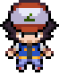
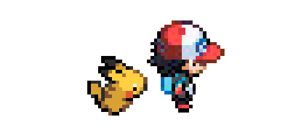

<div align="center">

# pokemanion

**Your Pokémon companion for Claude Code and Codex.**

One lives in a pane beside every session: it rests while the agent waits, and
does something else while it works — so you can tell from the corner of your eye
whether anything is happening.

[](https://github.com/khatriadbhut/pokemanion/actions/workflows/ci.yml)
[](LICENSE)
[](https://nodejs.org)
[](package.json)
[](#quick-install)
[](#requirements)

</div>

<table>
<tr>
  <th align="left" width="16%">waiting</th>
  <th align="left" width="22%">working</th>
  <th align="left">&nbsp;</th>
</tr>
<tr>
  <td align="center"></td>
  <td align="center"></td>
  <td>Charizard breathes fire across the empty half of the pane.</td>
</tr>
<tr>
  <td align="center"></td>
  <td align="center"></td>
  <td>Pikachu charges lightning in its cheeks, then runs.</td>
</tr>
<tr>
  <td align="center"></td>
  <td align="center"></td>
  <td>Psyduck throws its arms about, headache and all.</td>
</tr>
<tr>
  <td align="center"></td>
  <td align="center"></td>
  <td>Gengar fires a shadow beam across the pane.</td>
</tr>
<tr>
  <td align="center"></td>
  <td align="center"></td>
  <td>Ash waits, then runs off with Pikachu.</td>
</tr>
</table>

Fourteen hand-tuned residents ship with it. **1242 more** can be summoned by
name and are fetched on the spot.


A Pokéball opens whenever one arrives, and its stats appear beside it for a few
seconds. Everything is local: no account, no backend, nothing about you leaving
the machine.

<br clear="left">

---

## Quick install

**Get [Ghostty](https://ghostty.org/download) first** if you do not have it. The
pane is a Ghostty split, so there is no pane without it, and it is the one thing
here that cannot install itself. chafa, the other requirement, is fetched for
you.

Then, at your agent:

<table>
<tr>
<td valign="top" width="50%">

**Claude Code**

```
/plugin marketplace add khatriadbhut/pokemanion
/plugin install pokemanion@pokemanion
```

</td>
<td valign="top" width="50%">

**Codex**

```
/plugin marketplace add khatriadbhut/pokemanion
/plugin add pokemanion@pokemanion
```

</td>
</tr>
</table>

Nothing to clone or build; the agent fetches the project itself and the sprites
ship with it. Three things are left:

- **Allow Ghostty in Accessibility** — System Settings → Privacy & Security →
  Accessibility. Opening the pane means pressing keys, and macOS blocks that
  until you say so. Skip it and everything installs perfectly and no pane ever
  appears.
- **Restart your agent and Ghostty.** Both read their configuration at startup.
- **Open a new terminal**, or `source ~/.zshrc`, which picks up `claude
  --pikachu`.

Already have it from source? Installing the plugin too is harmless — it stands
aside rather than doubling up, and says how to switch.

---

**[Requirements](#requirements) · [Commands](#commands) · [From source](#install-from-source) · [Updating](#updating) · [Troubleshooting](#troubleshooting) · [Residents and
guests](#residents-and-guests) · [Settings](#settings) · [Your own
sprites](#your-own-sprites) · [Design notes](docs/design.md)**

<details>
<summary><b>All fourteen residents</b> — resting on the left, working on the right</summary>

<br>

<!-- gallery -->

| | resting | working |
| --- | :---: | :---: |
| **pikachu**<br><sub>own animation</sub> |  |  |
| **ash**<br><sub>own animation</sub> |  |  |
| **charmander**<br><sub>its shiny</sub> |  |  |
| **squirtle**<br><sub>its shiny</sub> |  |  |
| **bulbasaur**<br><sub>its shiny</sub> |  |  |
| **eevee**<br><sub>its shiny</sub> |  |  |
| **munchlax**<br><sub>its shiny</sub> |  |  |
| **haunter**<br><sub>its shiny</sub> |  |  |
| **psyduck**<br><sub>own animation</sub> |  |  |
| **jigglypuff**<br><sub>its shiny</sub> |  |  |
| **charizard**<br><sub>own animation</sub> |  |  |
| **meowth**<br><sub>own animation</sub> |  |  |
| **gengar**<br><sub>own animation</sub> |  |  |
| **cubone**<br><sub>own animation</sub> |  |  |

<!-- /gallery -->

These animate — they are the sprite files themselves, not pictures of them.
Seven work as their own shiny, the same animation recoloured with a white flash
at the switch; seven were given animations of their own.

</details>

## Requirements

**Node ≥ 20** (no dependencies), **chafa**, and a terminal that speaks the
[kitty graphics protocol](https://sw.kovidgoyal.net/kitty/graphics-protocol/) —
the sprite is a real image, not text.

| | draws the sprite | opens the pane | `claude --pikachu` |
| --- | :---: | :---: | :---: |
| **macOS + Ghostty** — the only tested setup | yes | yes | yes |
| macOS + kitty, iTerm2, WezTerm, Warp | yes | no | yes |
| Linux + kitty, Konsole | should | no | untested |
| Alacritty, Terminal.app, Windows | no | no | no |

Only the pane-opening is macOS-specific — it splits Ghostty through AppleScript.
Where the table says *no*, run the pane yourself in a second terminal with
`npm run window 4 --session=<id>`.

## Commands

Typed inside a session. pokemanion answers these itself and stops them there, so
they never reach the model and cost no tokens:

```
--squirtle          switch this pane, live
--random            roll one
--pokemon           list the residents

--dex               what you have, and how many exist
--dex dragonite     by name
--dex ghost         by type
--dex 149           by number
--dex current       the one you're looking at — answers in the pane
--dex random        be shown something

--pokemanion        the version, and how to update it
--use-plugin        switch to the plugin, if you have both installed
```

**Send them while the agent is idle** — typed mid-turn they reach the model
instead. Only a prompt that is *nothing but* the flag counts, so `what does
--pikachu do?` is a real question and passes through.

So do flags that are nothing like a Pokémon, `--update` and `--force` among
them. Typos do not: `--charizrd` gets a "did you mean".

Punctuation is forgiven and form names work as written: `--ho-oh`,
`--rotom-wash`, `--charizard-megax`.

At launch, from your terminal:

```sh
claude --pikachu             # a particular one
claude --flygon              # any of the 1256, fetched on first use
codex --random               # either agent, same flags
claude --resume --charizard  # combines with everything else
```

## Install from source

**The plugin is the one to use.** This route exists for working on the code:

```sh
git clone https://github.com/khatriadbhut/pokemanion.git
cd pokemanion
npm run deps      # chafa and Ghostty — skip if you have them
npm run setup
```

`setup` finds what you have — **Claude Code, Codex, or both** — and wires up
each: sprites, hooks, the `claude()`/`codex()` shell wrapper, and the one
Ghostty keybind the pane needs. It checks everything first and stops without
touching a file if something is missing. Safe to run twice.

Then four things no script can do for you:

1. **Restart your agent** — both read their hooks at startup.
2. **Restart Ghostty** — it reads its config at startup.
3. **Open a new terminal**, or `source ~/.zshrc`.
4. **Allow Ghostty in Accessibility** — once, as above.

<details>
<summary><b>Two things specific to Codex</b></summary>

<br>

**It will ask you to trust the hooks**, and it should — they are commands it is
about to run, and they sit in `~/.codex/hooks.json` where you can read them
first. Codex stores a hash per hook and silently skips any it has not reviewed,
so after updating this project run **`/hooks`** in Codex and trust them again.

**The pane appears at your first message, not at launch.** Codex does not
consider a session to exist until you say something, and offers no earlier hook.
Claude Code opens it the moment the session starts.

</details>

<details>
<summary><b>What it touches outside this folder</b></summary>

<br>

Every file is backed up before the first write, and every one comes back out:

| file | what goes in | undo |
| --- | --- | --- |
| `~/.claude/settings.json` | seven hooks | `npm run uninstall-statusline` |
| `~/.codex/hooks.json` | seven hooks | `npm run uninstall-statusline` |
| `~/.zshrc` | the `claude()`/`codex()` wrapper | `npm run shell -- --remove` |
| `~/.config/ghostty/config` | one resize keybind | `npm run ghostty -- --remove` |

Only the agents you actually have are touched. Undo those, delete the folder,
and no trace is left.

</details>

## Updating

pokemanion tells you when there is a newer version — it checks GitHub once a
day — and each route has its own command:

```
/plugin update pokemanion@pokemanion         # plugin, Claude Code
codex plugin marketplace upgrade &&          # plugin, Codex
  codex plugin add pokemanion@pokemanion
cd pokemanion && git pull && npm run setup   # from source
```

The pane's bottom edge carries the version, and the command when an update is
waiting. **`--pokemanion`** prints it in the conversation. Nothing is ever
installed for you.

`"updateCheck": false` stops the checks, `"showVersion": false` hides the corner.

## Troubleshooting

```sh
npm run doctor
```

It checks each piece on its own — hooks registered per agent, chafa present, the
frame cache matching your pane height, and which Pokémon are currently held —
and names whichever is unhappy.

**A sprite that stutters** is the frame cache. Frames are rendered per pane
height, so resizing the pane leaves it rendering on the fly: warm sprites load in
about 3 ms, cold ones take a second or two. `npm run warm -- <rows>` fixes it.

**The sprite is wrong at the wrong moment.** `npm run watch` prints the decision
the pane is making and what it rested on.
[docs/known-issues.md](docs/known-issues.md) explains where it frays — pressing
escape is the hard case, since no hook fires for it.

## Residents and guests

**Residents** are the 14 in `src/roster.mjs`: hand-tuned, always on disk,
pre-rendered so a session starts instantly, and the only ones the rotation hands
out.

**Guests** are the other 1242. They arrive when you name them — about two
seconds to fetch and render — then load in 2 ms thereafter. They are evicted
least-recently-shown first, and one a pane is currently showing is never
evicted.

Either way the session keeps it: the choice is written down and read back when a
pane reopens, so closing a window and coming back gives you the same Pokémon.
Naming one always overrules that.

```sh
npm run prune            # evict guests now; also happens on its own
npm run assigned         # what each session was given, and why
```

The whole set pre-rendered would be about **2.7 GB** of frame cache, which is
the entire reason for the split. Guests cost 1–5 MB each, bounded by
`guestBudgetMb` (200) and `guestKeepDays` (14).

## Settings

`config.json`, all optional. The ones worth knowing:

| key | default | meaning |
| --- | --- | --- |
| `windowRows` | `4` | how tall the pane is |
| `idleAfterMs` | `20000` | transcript silence that counts as finished |
| `workingTimeoutMs` | `120000` | how long after the last hook we still count as working |
| `transitions` | `true` | animate the change between the two sprites |
| `pokeball` | `true` | open a Pokéball when one arrives |
| `cardMs` | `8000` | how long the stats stay beside the sprite; `0` disables |
| `guestBudgetMb` | `200` | disk the guests may hold |
| `updateCheck` | `true` | look for a newer version once a day, and say so once |
| `showVersion` | `true` | the version along the pane's bottom edge |
| `logHooks` | `false` | record every hook to `.state/hooks.jsonl` |

## Your own sprites

Any GIF works. Drop it in `assets/` and point a roster entry at it:

```js
// src/roster.mjs
{ name: 'meowth', busy: 'assets/18-meowth-jumping.gif', busySpeed: 1 },
```

Hand-picked files are never overwritten or re-downloaded, and they override the
default — the Pokémon's own shiny palette, with a white flash between.

Judge a candidate at the size the pane draws, about 68 pixels tall. File size
lies in both directions: a 500×500 GIF that is really 40×39 upscaled is pixel
art and scales beautifully, while a 407×295 smooth render shrinks to mush.

Two tools for when an animation is nearly right: **`npm run recolour`** repaints
one palette to match another without re-encoding, and **`npm run flip`** mirrors
a sprite. Run `npm run attribution` after adding one.

<details>
<summary><b>Everything you can run</b></summary>

<br>

| command | what it does |
| --- | --- |
| `npm run doctor` | check every piece: hooks, chafa, cache, who holds what |
| `npm run watch` | print the working/waiting decision the pane is making, live |
| `npm run roster` | download any missing resident sprites (`-- --refresh` to redo) |
| `npm run warm` | render the residents for a pane height (`-- 5` for five rows) |
| `npm run deps` | install chafa and Ghostty (`-- --dry` to preview) |
| `npm run ghostty -- --install` | the resize keybind the pane needs (`--remove` to undo) |
| `npm run prune` | evict guests now (`-- --dry`, `-- --keep-days=0`) |
| `npm run assigned` | which Pokémon each session was given (`-- --forget` to reset) |
| `npm run dex` | the Pokédex from a terminal: `-- fire`, `-- 25`, `-- current` |
| `npm run attribution` | regenerate the credits (`-- --check` to fail if stale) |
| `npm run shell -- --install` | add the shell wrapper (`--remove` to undo) |
| `npm run install-statusline` | register the hooks (`uninstall-statusline` to undo) |
| `npm run window` | run a pane by hand, for debugging |
| `npm run recolour` | repaint a palette: `-- a.gif b.gif out.gif` |
| `npm run flip` | mirror a sprite: `-- in.gif out.gif` |
| `npm run crop` | cut one figure out of a sheet: `-- in.gif out.gif --find=3` |

The rest are tuning tools for working out what a terminal can draw —
`preview`, `compare`, `sizes`, `bakeoff`, `use`, `preset`, `fontcheck`,
`cellcheck`, and the `for-*` set. [docs/design.md](docs/design.md) explains
them. **`preset` and `for-*` write to `config.json`** rather than just
reporting.

</details>

## Licence and artwork

The **code** is MIT — see [LICENSE](LICENSE).

The **artwork is not mine and is not covered by it.** The Gen-5 sprites are Game
Freak's; the hand-picked GIFs are fan art found online.
[ATTRIBUTION.md](ATTRIBUTION.md) names what came from where, and anything will
be removed on request — sprites are read by path, so it is a one-line change.

Pokémon is a trademark of Nintendo. This is a personal tool, unaffiliated with
anyone, and nothing here is sold.

## Contributing

Issues and pull requests welcome, particularly:

- **A sprite that reads better than one in the roster.** Bring the numbers —
  `docs/design.md` says how they are measured, and the bar is scale ≤ 1.8x with
  ≥ 24 frames at the size the pane draws.
- **A Linux path.** Everything but the pane-opening is portable Node; it needs a
  way to open a split that is not AppleScript.

`npm test` before you push.

Also worth reading: [docs/design.md](docs/design.md) for why it is built this
way, and [docs/known-issues.md](docs/known-issues.md) for what is deliberately
wrong.
